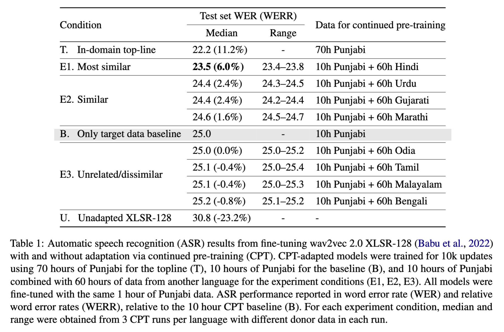
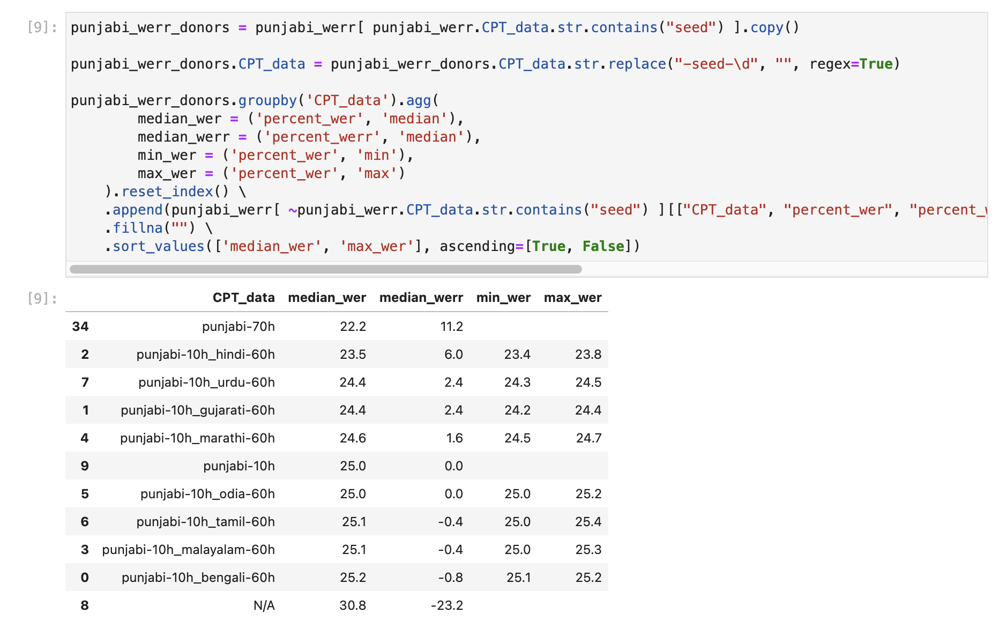
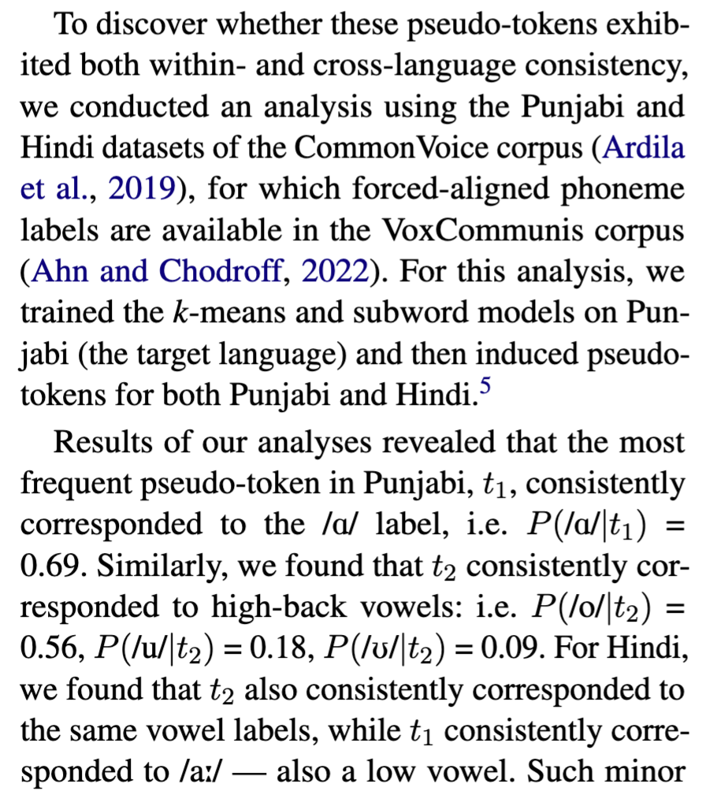
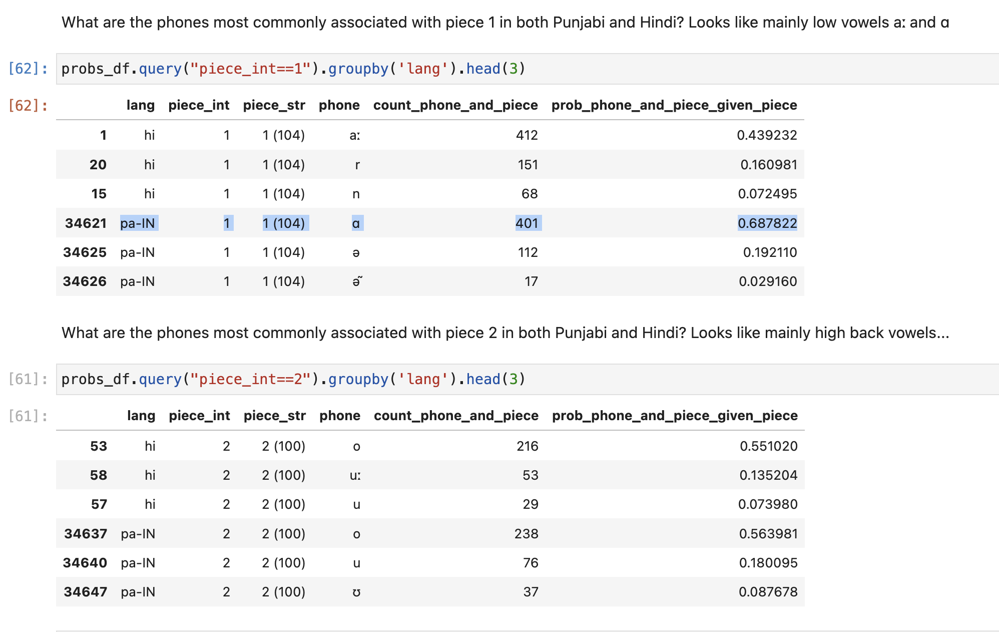
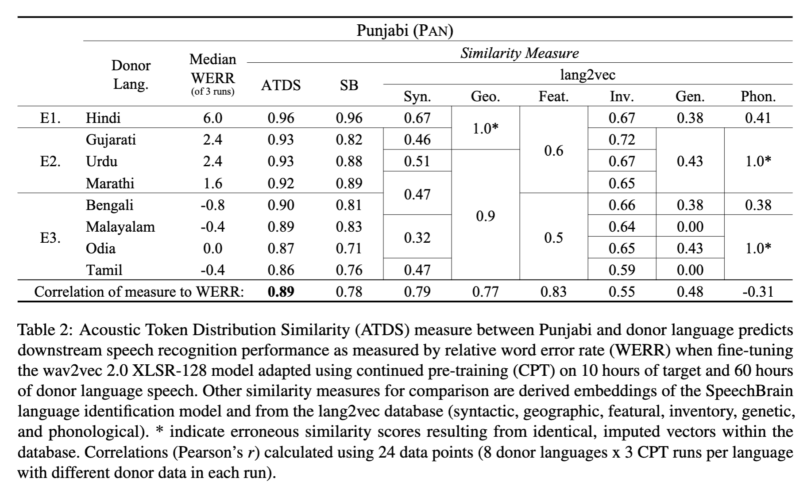
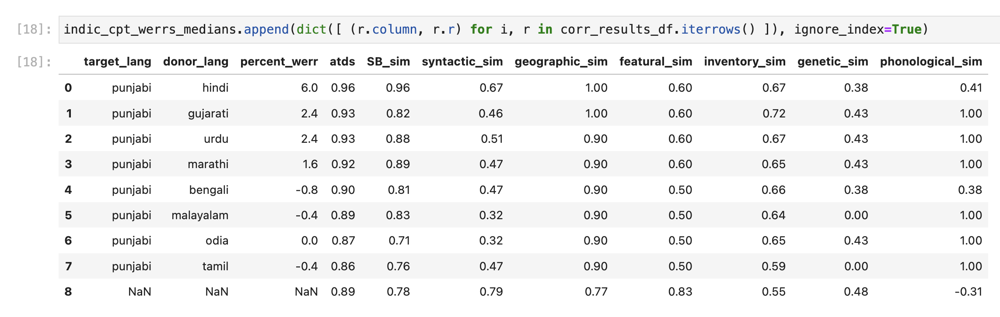
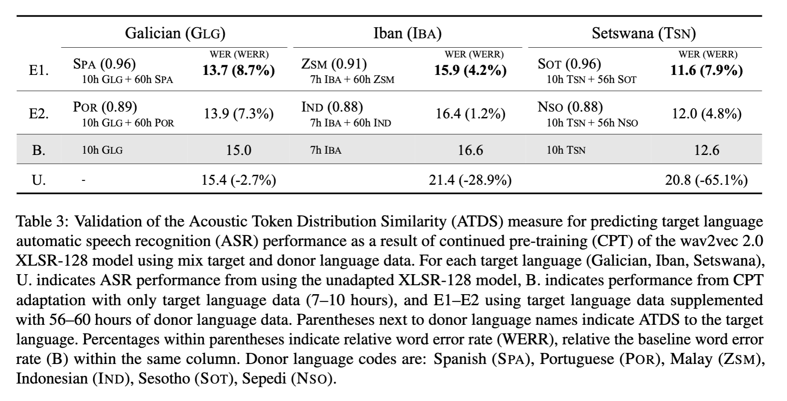
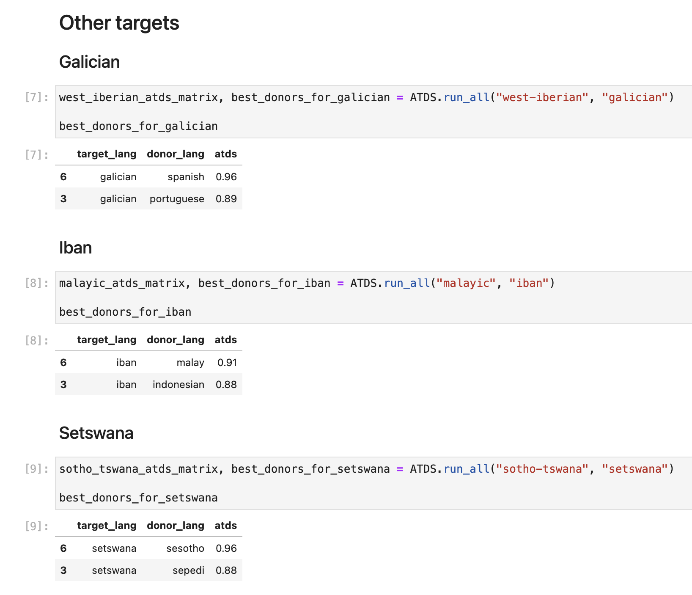
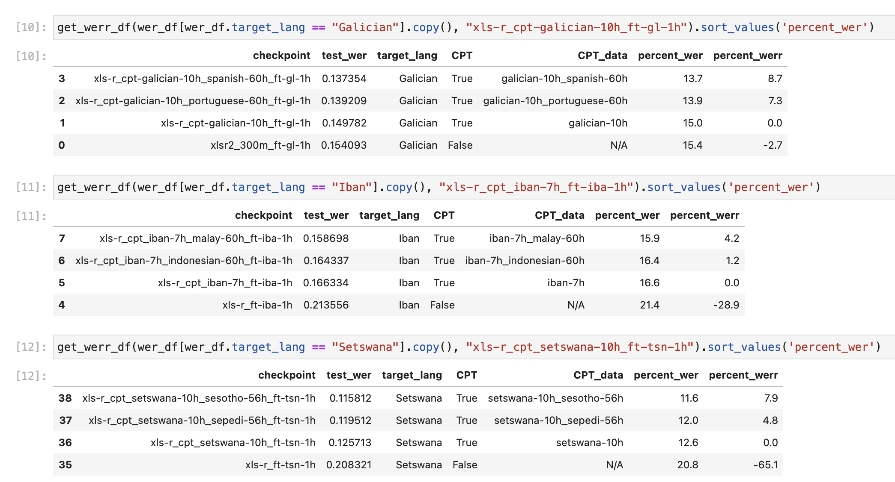

# Directory map

This directory contains analyses in various notebooks. We'll use tables presented in the paper as a way to organise what notebooks contain what information.

## Indic experiments: ASR evaluations

ASR performance reported for the Indic language experiments can be found in `analysis_word-error-rates.ipynb`

## Analysis of token/phoneme correspondences

We report based on an exploratory analysis how often a given token corresponded to a phoneme label:

This was done by appending 3 additional tiers `code`, `dedup-code`, `piece` to TextGrids for Punjabi and Hindi released in the VoxCommunis corpus:

We then computed `P(phone|piece)` for each piece. That is given a piece has been observed (e.g. `piece=1`), what is the probability of observing some phone label, e.g. `ɑ`? 

In the `analyses_token-phoneme-probs.ipynb` notebook, we show that `P(phone=ɑ|piece=1) = 0.69`, for example:

## Comparison of ATDS with SpeechBrain and lang2vec similarities

The `analysis_ATDS-SB-l2v.ipynb` contains the comparison of ATDS with SpeechBrain and lang2vec similarities

## Validation of ATDS on other target languages

For Galician, Iban and Setswana, the ATDS and ASR evaluations are reported together in Table 3.

The ATDS calculations for each language group (West-Iberian, Malayic, Sotho-Tswana) are found in `analysis_ATDS.ipynb`

ASR performance calculations can be found in `analysis_word-error-rates.ipynb`

